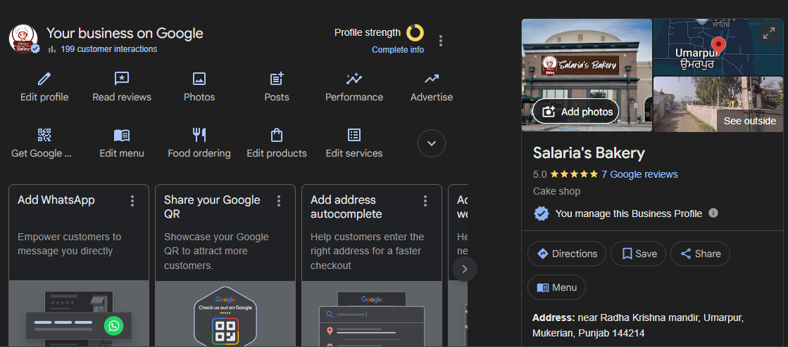
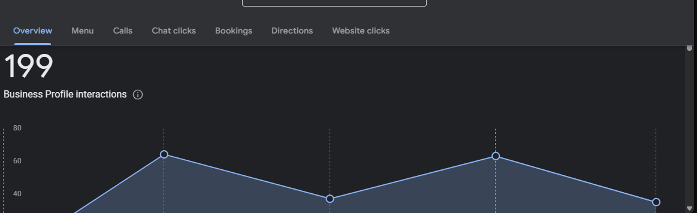
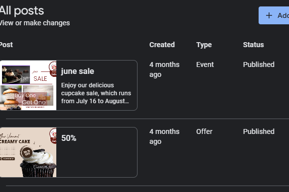

# 🧁 Salaria’s Bakery – Google My Business Optimization Project

## 📋 Overview
This project showcases the setup and optimization of a **Google My Business (GMB)** profile for *Salaria’s Bakery*, a local bakery business.  
The main objective was to improve the bakery’s **online presence**, **local search visibility**, and **customer engagement** through data-driven strategies.

---

## 🎯 Project Objectives
- Create and verify the Google My Business profile  
- Optimize business details, categories, and keywords  
- Add high-quality photos, posts, and product updates  
- Encourage customer reviews and respond effectively  
- Analyze GMB Insights to track performance  

---

## ⚙️ Tools & Platforms Used
- **Google My Business (GMB)** – setup and analytics  
- **Canva** – for post and image design  
- **Google Maps** – visibility and location optimization  
- **Google Analytics** – traffic and engagement tracking  

---

## 📈 Results
- Increased profile views and search appearances  
- More customer actions (calls, directions, website visits)  
- Improved local ranking for bakery-related keywords  
- Enhanced brand visibility and trust through reviews  

---
## 🖼️ Project Screenshots

---
## 💡 Key Learnings
- Consistent and accurate information boosts SEO  
- Visual content attracts more engagement  
- Responding to reviews builds loyalty and trust  
- Local SEO helps small businesses compete effectively  

---

## 👩‍💻 Created By
**Smriti Salaria**  
🎓 *Digital Marketing Student*  
💼 Focused on Local SEO, GMB Optimization, and Social Media Marketing  
🔗 [Connect on LinkedIn](www.linkedin.com/in/smritisalaria)  

---

## 📂 Project Type
> Digital Marketing / Local SEO / Google My Business Case Study
